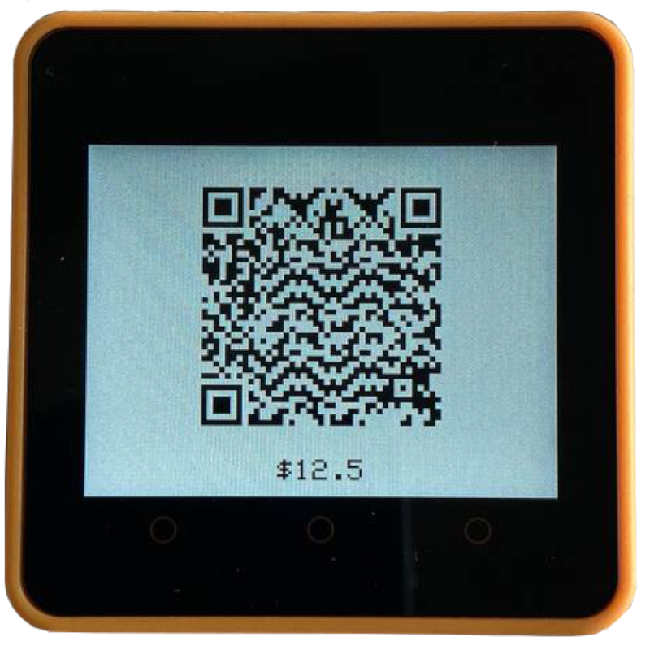

## Merchant Device Configuration

Once the device is turned on, it shows splash screen for 3 seconds and then switches to WiFi hotspot mode. 
On LCD screen you will see the SSID of WiFi network to connect to. 
This is the way to do the device configuration.

<p align="center">
    
</p>

Once you successfully join the WiFi network, head towards http://192.168.4.1/

Such page will allow to
- provide `WiFi Config` - in order for the Merchant POS to work, it needs to join WiFi network with internet access
  - `SSID` - name of network to join
  - `Password` - password to WiFi network
- `Processor Details/Registration`
  - `URL` (TBD) - address of processor
  - `Challenge Id` and `Challenge` (TBD) - information from Wallet portal to let merchant register POS
- `Securit`
  - `Password` - in order for merchant to access REST API exposed by POS terminal (e.g. to create the order), the request has to include header `Authorization: base64(user:${password})`

## Merchant to create Order on POS terminal

Once connected to WiFi (e.g. with IP `192.168.1.45`) and registered at Processor, the POS terminal moves to standby mode.

At this time the Merchant can create the order by calling `GET http://192.168.1.45/api/v1/orders/create?id=25ddd8c8-7a42-4b5a-8d07-080be99f2870&amount=130.00`, while providing the
- id - order id, e.g. `25ddd8c8-7a42-4b5a-8d07-080be99f2870`, must be unique
- amount - due amount

At this point the POS terminal shows the due amount on screen 

<p align="center">
    
</p>

and enables the BLE to let other device connect and start the payment. Now the other device can connect to BLE
- Service Id - `12345678-1234-1234-1234-123456789abc`
- Characteristic Id to share payer details - `2bb6c1d4-5831-4a4e-86bd-3df81fa7c774`

## Payer to share its details with POS terminal and retrieve the Payee Payment Request

1. By relying on above `Service Id & Characteristic Id` payer must share its details, e.g.

`BLE WRITE` to `12345678-1234-1234-1234-123456789abc/2bb6c1d4-5831-4a4e-86bd-3df81fa7c774` serialized & base64 encoded protobuf `Envelope > EnvelopeContent > DeviceSharePayerDetails`
```
CiRhZmFmYjlkYS1lMDY4LTQxNGMtYmVmYi1hNDFlODAzZmQ0YmISkgEKKjB4ZjM5OTAyYjEzM2ZiZGNmOTI2YzFmNDg2NjVjOThkMWIwMjhkOTA1YRoJU0VDUDI1NksxmgFYEioweGYzOTkwMmIxMzNmYmRjZjkyNmMxZjQ4NjY1Yzk4ZDFiMDI4ZDkwNWEaKjB4MTg1Y2Q0NTk3NTdhNjNlZDczZjIxMDBmNzBkMzExOTgzYjM3YmNhNg==
```

The above encoded message when printed as JSON is
```
{
  "id": "2bca706c-7b7f-42b2-b7cd-77e18806d27e",
  "content": {
    "address": "0xf39902b133fbdcf926c1f48665c98d1b028d905a",
    "algorithm": "SECP256K1",
    "deviceSharePayerDetails": {
      "from": "0xf39902b133fbdcf926c1f48665c98d1b028d905a",
      "fromProc": "0x185cd459757a63ed73f2100f70d311983b37bca6"
    }
  }
}
```

In such message the Payer tells to POS terminal its public address (`from`) and processor the payer trusts to (`fromProc`)

2. If all is good, the POS terminal uses such information to create the Payment Request, which can be retrieved by 

`BLE READ` from `12345678-1234-1234-1234-123456789abc/a20d3f9f-1d6e-4936-80ab-cd7cb8c8b550`. The message, which payer retrieves looks like

```
CiQzOTI3YTVhOS03M2E1LTRlNzktYjcyZS1jMWI2MjljYjI4MDYSowIKKjB4OGYzM2RjZWVlZGZjZjcxODVhYTQ4MGVlMTZkYjliOWJiNzQ1NzU2ZRoJU0VDUDI1NksxIANK5wEKAzEzMBIqMHhmMzk5MDJiMTMzZmJkY2Y5MjZjMWY0ODY2NWM5OGQxYjAyOGQ5MDVhGioweDE4NWNkNDU5NzU3YTYzZWQ3M2YyMTAwZjcwZDMxMTk4M2IzN2JjYTYiKjB4OGYzM2RjZWVlZGZjZjcxODVhYTQ4MGVlMTZkYjliOWJiNzQ1NzU2ZSoqMHgxODVjZDQ1OTc1N2E2M2VkNzNmMjEwMGY3MGQzMTE5ODNiMzdiY2E2MgRVU0RDOKHRucAGSiRlYWVhZDk3OS1hYTYwLTQ2NzktOTBhNy0yYTg3NTlhZTJkMzgahAEweDU3NjdmN2ViMjEzNzFiOWFhYzBmMjM2ZDY0ODA4MWI5NTQ4YTRjY2IzNDFkMzAwMmJlZjIyOGY5YzViY2JiNWE0MmViYzNjZGZiMDA0NThkODhkZDdlZmJiYTZiN2Y0Mzg2ZjM5ZTYwNTViNmRhMTU1YjhhMjE2Mzk2YTgwMDY3MWM=
```

or as JSON
```
{
  "id": "3927a5a9-73a5-4e79-b72e-c1b629cb2806",
  "content": {
    "address": "0x8f33dceeedfcf7185aa480ee16db9b9bb745756e",
    "algorithm": "SECP256K1",
    "reason": "CONFIRM",
    "paymentRequest": {
      "amount": "130",
      "from": "0xf39902b133fbdcf926c1f48665c98d1b028d905a",
      "fromProc": "0x185cd459757a63ed73f2100f70d311983b37bca6",
      "to": "0x8f33dceeedfcf7185aa480ee16db9b9bb745756e",
      "toProc": "0x185cd459757a63ed73f2100f70d311983b37bca6",
      "currency": "USDC",
      "createdAt": "1745774753",
      "correlationId": "eaead979-aa60-4679-90a7-2a8759ae2d38"
    }
  },
  "sig": "0x5767f7eb21371b9aac0f236d648081b9548a4ccb341d3002bef228f9c5bcbb5a42ebc3cdfb00458d88dd7efbba6b7f4386f39e6055b6da155b8a216396a800671c"
}
```

This message represents the request for liability from Payer (`from`) to Payee (`to`). 

## Payer to confirm financial obligation

If payer is okay with requested payment details, Payer signs the Payment Request with its signature, e.g.

```
CiQ2YTcxY2UyMy02N2I2LTQyNTgtYmQ5Ni0zN2MwZmE2ZDdjZDYSjwQKKjB4ZjM5OTAyYjEzM2ZiZGNmOTI2YzFmNDg2NjVjOThkMWIwMjhkOTA1YRoJU0VDUDI1NksxIAMq0wMKJDM5MjdhNWE5LTczYTUtNGU3OS1iNzJlLWMxYjYyOWNiMjgwNhKjAgoqMHg4ZjMzZGNlZWVkZmNmNzE4NWFhNDgwZWUxNmRiOWI5YmI3NDU3NTZlGglTRUNQMjU2SzEgA0rnAQoDMTMwEioweGYzOTkwMmIxMzNmYmRjZjkyNmMxZjQ4NjY1Yzk4ZDFiMDI4ZDkwNWEaKjB4MTg1Y2Q0NTk3NTdhNjNlZDczZjIxMDBmNzBkMzExOTgzYjM3YmNhNiIqMHg4ZjMzZGNlZWVkZmNmNzE4NWFhNDgwZWUxNmRiOWI5YmI3NDU3NTZlKioweDE4NWNkNDU5NzU3YTYzZWQ3M2YyMTAwZjcwZDMxMTk4M2IzN2JjYTYyBFVTREM4odO5wAZKJGVhZWFkOTc5LWFhNjAtNDY3OS05MGE3LTJhODc1OWFlMmQzOBqEATB4MjNiMTI3MWU4ODEyYzA4MmVhZTdiZTgwMDYwY2ZmMTNjYWZkYzAxYmVjMjljZGRjYzUzYTJhZDdmMzJjMzRlNDM1MjgzMTM4NDNiZGIyNGIzMjM2MGUwYjJhN2NlM2YyNGUzZjc2MzRmYjRhYWFjOWQ4MmM4ZWFjYzljYjBjODQxYxqEATB4Nzc4N2MwYmJhNTI2ODdkM2E5YWJjNDcxMDg5NmIzMDYwN2Q5ZjllZDE3MDA0YmU2ZDI0Y2ZkY2UzYjE5NmEwMTE0YzEyOTY5NzMyOWQyZTUwNzk4YjRmNDJiMGFhYWMwYzM2YWIxMzNlYjY2NGU5YjJhOWIwOWIxMmU1M2Q3ZGUxYw==
```

or as JSON
```
{
  "id": "6a71ce23-67b6-4258-bd96-37c0fa6d7cd6",
  "content": {
    "address": "0xf39902b133fbdcf926c1f48665c98d1b028d905a",
    "algorithm": "SECP256K1",
    "reason": "CONFIRM",
    "envelope": {
      "id": "3927a5a9-73a5-4e79-b72e-c1b629cb2806",
      "content": {
        "address": "0x8f33dceeedfcf7185aa480ee16db9b9bb745756e",
        "algorithm": "SECP256K1",
        "reason": "CONFIRM",
        "paymentRequest": {
          "amount": "130",
          "from": "0xf39902b133fbdcf926c1f48665c98d1b028d905a",
          "fromProc": "0x185cd459757a63ed73f2100f70d311983b37bca6",
          "to": "0x8f33dceeedfcf7185aa480ee16db9b9bb745756e",
          "toProc": "0x185cd459757a63ed73f2100f70d311983b37bca6",
          "currency": "USDC",
          "createdAt": "1745775009",
          "correlationId": "eaead979-aa60-4679-90a7-2a8759ae2d38"
        }
      },
      "sig": "0x23b1271e8812c082eae7be80060cff13cafdc01bec29cddcc53a2ad7f32c34e43528313843bdb24b32360e0b2a7ce3f24e3f7634fb4aaac9d82c8eacc9cb0c841c"
    }
  },
  "sig": "0x7787c0bba52687d3a9abc4710896b30607d9f9ed17004be6d24cfdce3b196a0114c129697329d2e50798b4f42b0aaac0c36ab133eb664e9b2a9b09b12e53d7de1c"
}
```

## Payer to issue E-Check and share it to POS terminal

```
CiQ4MjMzZDE1Ny0xNDJiLTQyMWYtOTNhMC0zOTU3ZmIyZmNhYmIS2ggKKjB4MTg1Y2Q0NTk3NTdhNjNlZDczZjIxMDBmNzBkMzExOTgzYjM3YmNhNhoJU0VDUDI1NksxIAMqnggKJGE2ZGE5NDQ5LTRmNjYtNDI5MC04OTdhLTEyOGE5ZjVjMWExYxLuBgoqMHhmMzk5MDJiMTMzZmJkY2Y5MjZjMWY0ODY2NWM5OGQxYjAyOGQ5MDVhGglTRUNQMjU2SzEgAyqyBgokNzI3MGJiZWItMzEyMi00YTQ2LTgyMjMtNDRlY2U3MDkyNzA1EoIFCioweDE4NWNkNDU5NzU3YTYzZWQ3M2YyMTAwZjcwZDMxMTk4M2IzN2JjYTYaCVNFQ1AyNTZLMSADOsYECgRmbGF0EgMxLjUiuAQKJDM3Mzg3YWU4LTVlMmEtNDI1Mi1hYjg3LTc2YzM0OTA0NDQwMBKIAwoqMHhmMzk5MDJiMTMzZmJkY2Y5MjZjMWY0ODY2NWM5OGQxYjAyOGQ5MDVhGglTRUNQMjU2SzEgAVLMAgoDMTMwEgRVU0RDGioweGYzOTkwMmIxMzNmYmRjZjkyNmMxZjQ4NjY1Yzk4ZDFiMDI4ZDkwNWEiKjB4MTg1Y2Q0NTk3NTdhNjNlZDczZjIxMDBmNzBkMzExOTgzYjM3YmNhNioqMHg4ZjMzZGNlZWVkZmNmNzE4NWFhNDgwZWUxNmRiOWI5YmI3NDU3NTZlMioweDE4NWNkNDU5NzU3YTYzZWQ3M2YyMTAwZjcwZDMxMTk4M2IzN2JjYTY6XQoDMTMwEioweDhmMzNkY2VlZWRmY2Y3MTg1YWE0ODBlZTE2ZGI5YjliYjc0NTc1NmUaKjB4MTg1Y2Q0NTk3NTdhNjNlZDczZjIxMDBmNzBkMzExOTgzYjM3YmNhNkCn2LnABkinv77PBlokZWFlYWQ5NzktYWE2MC00Njc5LTkwYTctMmE4NzU5YWUyZDM4GoQBMHhkZTUxNTBhZmIzMDI2MzM1NzU2NDhjYmZhODY3MTE0MjE1NjAyMGUzNzEwOTY3ZmRiOTRiMjA2YzcyMjFkOWVjNzUxMDZlMGU2YWMyOWY4MzM0ODRjNDk1NWIzZTRlMGM1YTYwZGUwM2Q3NTY5Njg1ODRmOWJkZWZjZmY3OWRmZjFjGoQBMHhlMzE0ZDZmYzg3ZDk5YzE1MDViZTg2YmRiNjdkNmMyNWIwYjczMzZiZDY3N2I3ZTg2N2M2ZjE3MTU4NjEyZGE2MTJkZDJkZjhjN2Y5YjJmNWU4NWY5YzExMjI1NWY0YWY1M2ExOTRjZmUxYjFjYzA4MzU5ZTkyZGVjZTdkMDFmYzFiGoQBMHg0ZTY5NzRlZDkyOTRjNDMzNGYwOGFjOTliNzMwNmY4NDVmOGE0ZjgwY2ZlNDU3MzE4MjNjN2Y4NWQyZDRlZThmNzE2M2ViYzNlM2I0YjkwOTIwOTViOTE0ZjIwZTNmNDJlNzU0ZDc0YzU2OWViNjZmNDNmZDZkMDMwYTViODhmNTFjGoQBMHhmMDhlYTZhMTgwODY3YjhjMThmODIyM2FhNWZhZGViODY2MmQzYzgyMmQ4NzhkZThiMWMxYTA0MTVmYzg1YjgzMjIyNTA2MDAxNzdjYjI2OTFhNTEwZWQ4ODJjNDVlMzQ1YTEyOWMwZWFmMTUwYjJiOTYxNDMyYzA1ZWU3YWM2NDFi
```

or as JSON
```
{
  "id": "8233d157-142b-421f-93a0-3957fb2fcabb",
  "content": {
    "address": "0x185cd459757a63ed73f2100f70d311983b37bca6",
    "algorithm": "SECP256K1",
    "reason": "CONFIRM",
    "envelope": {
      "id": "a6da9449-4f66-4290-897a-128a9f5c1a1c",
      "content": {
        "address": "0xf39902b133fbdcf926c1f48665c98d1b028d905a",
        "algorithm": "SECP256K1",
        "reason": "CONFIRM",
        "envelope": {
          "id": "7270bbeb-3122-4a46-8223-44ece7092705",
          "content": {
            "address": "0x185cd459757a63ed73f2100f70d311983b37bca6",
            "algorithm": "SECP256K1",
            "reason": "CONFIRM",
            "processingFee": {
              "feeType": "flat",
              "amount": "1.5",
              "envelope": {
                "id": "37387ae8-5e2a-4252-ab87-76c349044400",
                "content": {
                  "address": "0xf39902b133fbdcf926c1f48665c98d1b028d905a",
                  "algorithm": "SECP256K1",
                  "reason": "IDENTITY",
                  "check": {
                    "faceAmount": "130",
                    "currency": "USDC",
                    "from": "0xf39902b133fbdcf926c1f48665c98d1b028d905a",
                    "fromProc": "0x185cd459757a63ed73f2100f70d311983b37bca6",
                    "to": "0x8f33dceeedfcf7185aa480ee16db9b9bb745756e",
                    "toProc": "0x185cd459757a63ed73f2100f70d311983b37bca6",
                    "splits": [{
                      "amount": "130",
                      "to": "0x8f33dceeedfcf7185aa480ee16db9b9bb745756e",
                      "toProc": "0x185cd459757a63ed73f2100f70d311983b37bca6"
                    }],
                    "createdAt": "1745775655",
                    "expiresAt": "1777311655",
                    "correlationId": "eaead979-aa60-4679-90a7-2a8759ae2d38"
                  }
                },
                "sig": "0xde5150afb302633575648cbfa8671142156020e3710967fdb94b206c7221d9ec75106e0e6ac29f833484c4955b3e4e0c5a60de03d756968584f9bdefcff79dff1c"
              }
            }
          },
          "sig": "0xe314d6fc87d99c1505be86bdb67d6c25b0b7336bd677b7e867c6f17158612da612dd2df8c7f9b2f5e85f9c112255f4af53a194cfe1b1cc08359e92dece7d01fc1b"
        }
      },
      "sig": "0x4e6974ed9294c4334f08ac99b7306f845f8a4f80cfe45731823c7f85d2d4ee8f7163ebc3e3b4b9092095b914f20e3f42e754d74c569eb66f43fd6d030a5b88f51c"
    }
  },
  "sig": "0xf08ea6a180867b8c18f8223aa5fadeb8662d3c822d878de8b1c1a0415fc85b8322250600177cb2691a510ed882c45e345a129c0eaf150b2b961432c05ee7ac641b"
}
```

and performs `BLE WRITE` to `12345678-1234-1234-1234-123456789abc/a0dd609f-fbda-4996-ab9c-6d53fe763945`

## POS terminal stored Payment Request & E-Check as Deposit Request

```
CiQ1OGJiOGUxOC1mMjIxLTQ0MzAtYjA5ZS0zMzQ1MGE4YTVhYjASixAKKjB4OGYzM2RjZWVlZGZjZjcxODVhYTQ4MGVlMTZkYjliOWJiNzQ1NzU2ZRoJU0VDUDI1NksxIANqzw8KigoKJDgyMzNkMTU3LTE0MmItNDIxZi05M2EwLTM5NTdmYjJmY2FiYhLaCAoqMHgxODVjZDQ1OTc1N2E2M2VkNzNmMjEwMGY3MGQzMTE5ODNiMzdiY2E2GglTRUNQMjU2SzEgAyqeCAokYTZkYTk0NDktNGY2Ni00MjkwLTg5N2EtMTI4YTlmNWMxYTFjEu4GCioweGYzOTkwMmIxMzNmYmRjZjkyNmMxZjQ4NjY1Yzk4ZDFiMDI4ZDkwNWEaCVNFQ1AyNTZLMSADKrIGCiQ3MjcwYmJlYi0zMTIyLTRhNDYtODIyMy00NGVjZTcwOTI3MDUSggUKKjB4MTg1Y2Q0NTk3NTdhNjNlZDczZjIxMDBmNzBkMzExOTgzYjM3YmNhNhoJU0VDUDI1NksxIAM6xgQKBGZsYXQSAzEuNSK4BAokMzczODdhZTgtNWUyYS00MjUyLWFiODctNzZjMzQ5MDQ0NDAwEogDCioweGYzOTkwMmIxMzNmYmRjZjkyNmMxZjQ4NjY1Yzk4ZDFiMDI4ZDkwNWEaCVNFQ1AyNTZLMSABUswCCgMxMzASBFVTREMaKjB4ZjM5OTAyYjEzM2ZiZGNmOTI2YzFmNDg2NjVjOThkMWIwMjhkOTA1YSIqMHgxODVjZDQ1OTc1N2E2M2VkNzNmMjEwMGY3MGQzMTE5ODNiMzdiY2E2KioweDhmMzNkY2VlZWRmY2Y3MTg1YWE0ODBlZTE2ZGI5YjliYjc0NTc1NmUyKjB4MTg1Y2Q0NTk3NTdhNjNlZDczZjIxMDBmNzBkMzExOTgzYjM3YmNhNjpdCgMxMzASKjB4OGYzM2RjZWVlZGZjZjcxODVhYTQ4MGVlMTZkYjliOWJiNzQ1NzU2ZRoqMHgxODVjZDQ1OTc1N2E2M2VkNzNmMjEwMGY3MGQzMTE5ODNiMzdiY2E2QOTaucAGSOTBvs8GWiRlYWVhZDk3OS1hYTYwLTQ2NzktOTBhNy0yYTg3NTlhZTJkMzgahAEweDJkYzU5NTJkMzU1MWJhYzU5Y2RkZjYwNWUxNDVmOWRjMWNiZGQ0YzVmNWYxZTA4ZDIzMjU5YmQwY2Y3NTNkZmMwMGZmMzRjMjY4YmExYjUwMWNhMWZlNDVkYjliOTY3M2YxMTYyYTJiZWRlMWJmMWFiY2UyNGZjZWNhNWNlNTQ2MWIahAEweDYwYjNkZWQwODY3MzY5ODM1Y2MwODUzZjAwY2JjYmRmYTJmOTk4NGExNjRhZGE4ZTUxN2I4ZTYxNDYzYTUzYmMxY2I1MmFkNDMzZjQ2YTUzMGJmNzI5Nzk1NzkzZDk1NjA4ZWIxNzlkY2EyNmFlNDI2YTlkODY1MDFkMjNlMmE3MWMahAEweDY0ZjNkMWFkMjBhNTA3OTBmOGZhMGUyYzczMmRkNmM5M2ExNzA3NTMyNjI2MzkwYTIyYzk1MjhlNjAyYWI4ODU3NmJkYWU1OGM1N2I3YjYzOTZiZWQyZWU3MjE1YjE5MTJmNGY5ZDkyZTkwMWYwNWQ5MDZhNGE4MDQ4MmRjZjM1MWIahAEweGQxMGYzZDE2ZWVjMzJhYzJlYWI0YmFjZjA3YzJlYzc5OTI0M2NhNDllMzBlYzJhMTg4NmM3YjIwZGRmZDAwZTEyZmU4OGIyNDk5YmJkYTFkYjY2MTEzMzViNjk0NDcyZjk3MGZmNDMwZjg3ZTg4OGRiNDFiYTJhMWQ3YWUwZTgzMWISvwUKJDZhNzFjZTIzLTY3YjYtNDI1OC1iZDk2LTM3YzBmYTZkN2NkNhKPBAoqMHhmMzk5MDJiMTMzZmJkY2Y5MjZjMWY0ODY2NWM5OGQxYjAyOGQ5MDVhGglTRUNQMjU2SzEgAyrTAwokMzkyN2E1YTktNzNhNS00ZTc5LWI3MmUtYzFiNjI5Y2IyODA2EqMCCioweDhmMzNkY2VlZWRmY2Y3MTg1YWE0ODBlZTE2ZGI5YjliYjc0NTc1NmUaCVNFQ1AyNTZLMSADSucBCgMxMzASKjB4ZjM5OTAyYjEzM2ZiZGNmOTI2YzFmNDg2NjVjOThkMWIwMjhkOTA1YRoqMHgxODVjZDQ1OTc1N2E2M2VkNzNmMjEwMGY3MGQzMTE5ODNiMzdiY2E2IioweDhmMzNkY2VlZWRmY2Y3MTg1YWE0ODBlZTE2ZGI5YjliYjc0NTc1NmUqKjB4MTg1Y2Q0NTk3NTdhNjNlZDczZjIxMDBmNzBkMzExOTgzYjM3YmNhNjIEVVNEQzjk2rnABkokZWFlYWQ5NzktYWE2MC00Njc5LTkwYTctMmE4NzU5YWUyZDM4GoQBMHgyODExNTNlOWFhZWYzN2M0YTFhYzEzMDk0ZDU3YjI4M2EyYzY4NTA4MDhjMTZjMjljM2JhY2ViYTgwNjlmZGE1NmI3ZmZjMWUzOTE4ZWM5NDM4NjQyN2Q3NTgyZTgwZTkxZmMwMzY3NDUxMTJiNjUwNDhiNDBjNTAyMTJkMjU0YzFiGoQBMHg1M2NmNzE1ZWM3YjFhYzg5MjViMzFjNTllM2M0Njc1NGMyNjVjYmQ4MGVkZTc2YTliMWVlZGU3NDZkMWU5OTg4MjA2YjQ5MWUwYTE4ZGI4YzlkNTg0YTQ4ZGYyMDNmODQyOTk1M2QzMmNiYTQ0OTY2MWZlZTM4Mjc2ODE0NjIwNzFjGoQBMHhlOWZkY2Q2MmY3ZWRkMTczMDY4N2NkZmUxMGQ3MzYzZjBhZDg4MmIxYzI3NDlkNjBhZTNhMmY0ZGQ0MmZiY2M5MWM4YmYzZDViMjEzYmMxNTAzNDA4MDMwNjU2NzRhYzVjZDY4MjYxYTg2NGNhMDlkMWNhYmNhZWM4NGIxNmM1MTFj
```

or as JSON
```
{
  "id": "58bb8e18-f221-4430-b09e-33450a8a5ab0",
  "content": {
    "address": "0x8f33dceeedfcf7185aa480ee16db9b9bb745756e",
    "algorithm": "SECP256K1",
    "reason": "CONFIRM",
    "depositRequest": {
      "checkEnvelope": {
        "id": "8233d157-142b-421f-93a0-3957fb2fcabb",
        "content": {
          "address": "0x185cd459757a63ed73f2100f70d311983b37bca6",
          "algorithm": "SECP256K1",
          "reason": "CONFIRM",
          "envelope": {
            "id": "a6da9449-4f66-4290-897a-128a9f5c1a1c",
            "content": {
              "address": "0xf39902b133fbdcf926c1f48665c98d1b028d905a",
              "algorithm": "SECP256K1",
              "reason": "CONFIRM",
              "envelope": {
                "id": "7270bbeb-3122-4a46-8223-44ece7092705",
                "content": {
                  "address": "0x185cd459757a63ed73f2100f70d311983b37bca6",
                  "algorithm": "SECP256K1",
                  "reason": "CONFIRM",
                  "processingFee": {
                    "feeType": "flat",
                    "amount": "1.5",
                    "envelope": {
                      "id": "37387ae8-5e2a-4252-ab87-76c349044400",
                      "content": {
                        "address": "0xf39902b133fbdcf926c1f48665c98d1b028d905a",
                        "algorithm": "SECP256K1",
                        "reason": "IDENTITY",
                        "check": {
                          "faceAmount": "130",
                          "currency": "USDC",
                          "from": "0xf39902b133fbdcf926c1f48665c98d1b028d905a",
                          "fromProc": "0x185cd459757a63ed73f2100f70d311983b37bca6",
                          "to": "0x8f33dceeedfcf7185aa480ee16db9b9bb745756e",
                          "toProc": "0x185cd459757a63ed73f2100f70d311983b37bca6",
                          "splits": [{
                            "amount": "130",
                            "to": "0x8f33dceeedfcf7185aa480ee16db9b9bb745756e",
                            "toProc": "0x185cd459757a63ed73f2100f70d311983b37bca6"
                          }],
                          "createdAt": "1745775972",
                          "expiresAt": "1777311972",
                          "correlationId": "eaead979-aa60-4679-90a7-2a8759ae2d38"
                        }
                      },
                      "sig": "0x2dc5952d3551bac59cddf605e145f9dc1cbdd4c5f5f1e08d23259bd0cf753dfc00ff34c268ba1b501ca1fe45db9b9673f1162a2bede1bf1abce24fceca5ce5461b"
                    }
                  }
                },
                "sig": "0x60b3ded0867369835cc0853f00cbcbdfa2f9984a164ada8e517b8e61463a53bc1cb52ad433f46a530bf729795793d95608eb179dca26ae426a9d86501d23e2a71c"
              }
            },
            "sig": "0x64f3d1ad20a50790f8fa0e2c732dd6c93a1707532626390a22c9528e602ab88576bdae58c57b7b6396bed2ee7215b1912f4f9d92e901f05d906a4a80482dcf351b"
          }
        },
        "sig": "0xd10f3d16eec32ac2eab4bacf07c2ec799243ca49e30ec2a1886c7b20ddfd00e12fe88b2499bbda1db6611335b694472f970ff430f87e888db41ba2a1d7ae0e831b"
      },
      "requestEnvelopes": [{
        "id": "6a71ce23-67b6-4258-bd96-37c0fa6d7cd6",
        "content": {
          "address": "0xf39902b133fbdcf926c1f48665c98d1b028d905a",
          "algorithm": "SECP256K1",
          "reason": "CONFIRM",
          "envelope": {
            "id": "3927a5a9-73a5-4e79-b72e-c1b629cb2806",
            "content": {
              "address": "0x8f33dceeedfcf7185aa480ee16db9b9bb745756e",
              "algorithm": "SECP256K1",
              "reason": "CONFIRM",
              "paymentRequest": {
                "amount": "130",
                "from": "0xf39902b133fbdcf926c1f48665c98d1b028d905a",
                "fromProc": "0x185cd459757a63ed73f2100f70d311983b37bca6",
                "to": "0x8f33dceeedfcf7185aa480ee16db9b9bb745756e",
                "toProc": "0x185cd459757a63ed73f2100f70d311983b37bca6",
                "currency": "USDC",
                "createdAt": "1745775972",
                "correlationId": "eaead979-aa60-4679-90a7-2a8759ae2d38"
              }
            },
            "sig": "0x281153e9aaef37c4a1ac13094d57b283a2c6850808c16c29c3baceba8069fda56b7ffc1e3918ec94386427d7582e80e91fc036745112b65048b40c50212d254c1b"
          }
        },
        "sig": "0x53cf715ec7b1ac8925b31c59e3c46754c265cbd80ede76a9b1eede746d1e9988206b491e0a18db8c9d584a48df203f8429953d32cba449661fee3827681462071c"
      }]
    }
  },
  "sig": "0xe9fdcd62f7edd1730687cdfe10d7363f0ad882b1c2749d60ae3a2f4dd42fbcc91c8bf3d5b213bc150340803065674ac5cd68261a864ca09d1cabcaec84b16c511c"
}
```

## POS terminal saves DeviceTransactionCompleted for Payer to retrieve

```
CiQ3M2RhMDExNi0xMWY1LTQ0NWItYjQ4OS0wNWE5NWE3NTE3YTUSKaIBJgokZWFlYWQ5NzktYWE2MC00Njc5LTkwYTctMmE4NzU5YWUyZDM4
```

or as JSON
```
{
  "id": "73da0116-11f5-445b-b489-05a95a7517a5",
  "content": {
    "deviceTransactionCompleted": {
      "correlationId": "eaead979-aa60-4679-90a7-2a8759ae2d38"
    }
  }
}
```

As soon as Payment Request & E-Check are received by POS terminal, from Payer, the payment is considered to be complete. As a result, the POS terminal changes screen text to `Welcome` inviting another payer

<p align="center">
    
</p>

## Debug Mode

Check `config.h` file, that one includes

```
#define IF_DEBUG 1
```

such configuration let the POS terminal 
- expose `GET /debug` endpoint, to let developer READ internal state without relying on BLE
- save Payee (POS terminal) created Payment Request to `/${orderId}_debug_payee_request.txt`
- save Payer signed Payment Request to `/${orderId}_debug_payer_request.txt`
- save Payer issued E-Check to `/${orderId}_debug_e_check.txt`

## POS terminal Merchant API

- Create order - http://192.168.1.45/api/v1/orders/create?id=25ddd8c8-7a42-4b5a-8d07-080be99f2870&amount=130.00
- Cancel order - http://192.168.1.45/api/v1/orders/cancel
- View FS files - http://192.168.1.45/api/v1/orders/list?path=/
- Get FS file content - http://192.168.1.45/api/v1/orders/get?path=/25ddd8c8-7a42-4b5a-8d07-080be99f2870_debug_payee_request.txt
- Delete FS file - http://192.168.1.45/api/v1/orders/delete?path=/25ddd8c8-7a42-4b5a-8d07-080be99f2870_debug_payee_request.txt
- (if debug enabled) Current Order Details & BLE state variable - http://192.168.1.45/debug
