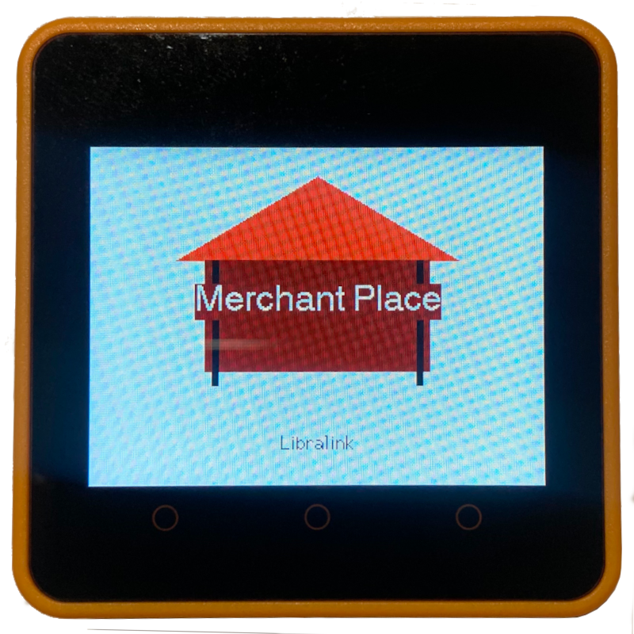

## LibraLink - Merchant's Point of Sale

<p align="center">
    
</p>

### Verified Development Boards

- [M5Stack Official Core2 ESP32 IoT Development Kit for AWS IoT Kit](https://www.amazon.com/dp/B08VGRZYJR)
- [M5Stack Official Core2 ESP32 IoT Development Kit V1.1](https://www.amazon.com/dp/B0DQSTJXMC)

### Clone
```
git clone --recurse-submodules git@github.com:libralinknetwork/libralink-client-pos.git
```

Pull Sub-Module
```
git submodule update --remote --merge
```

### Arduino IDE Configuration
#### Board

- Board Manager - `esp32 by Espressif Systems`
- Board - `M5Stack-Core-ESP32`

#### Partition Scheme

`Huge APP (3MB No OTA)` or `No OTA (Large App)`

This gives you almost 3MB of flash for your program.

#### Upload Spead

`Tools > Upload Speed > 115200` - most stable, but can change depending on device

### Building

#### Precondition
```
brew install protobuf
brew install nanopb

cd ~/Arduino/libraries
git clone https://github.com/nanopb/nanopb.git
```

#### Compile Proto
```
protoc --proto_path=libralink-protocol/src/main/proto \
       --nanopb_out=. \
       libralink-protocol/src/main/proto/libralink.proto
```

The next files will be generated
```
libralink.pb.c
libralink.pb.h
```